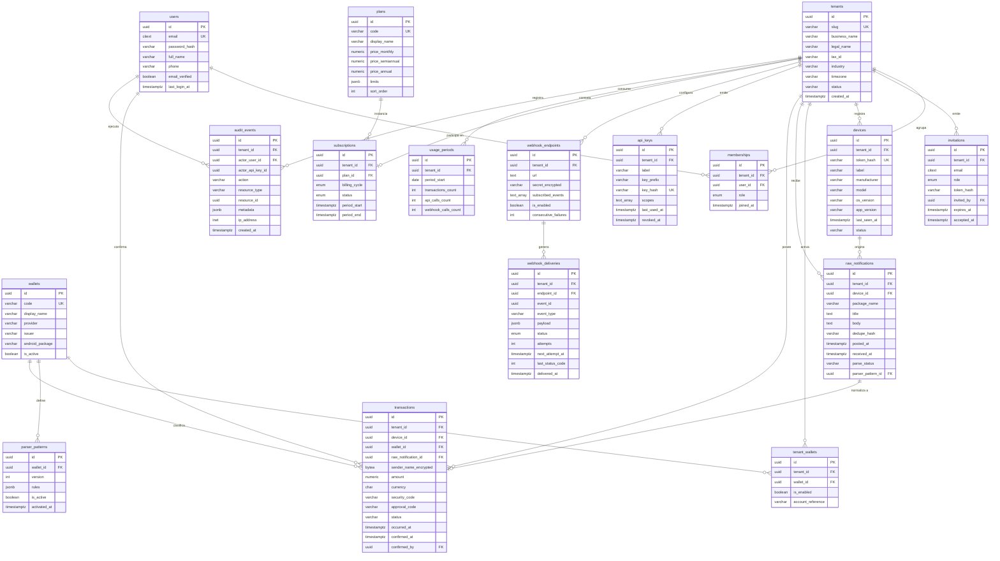

# 05 — Modelo de Datos

> **Motor relacional:** PostgreSQL 16+
> **ORM:** Prisma
> **Cache y colas:** Redis 7+

---

## 1. Decisiones de modelado

| Decisión                                              | Justificación                                                                                               |
| ----------------------------------------------------- | ----------------------------------------------------------------------------------------------------------- |
| **UUID como clave primaria**                          | Evita enumeración de recursos; permite generar identificadores en el cliente                                |
| **`tenant_id` explícito en toda tabla de negocio**    | Habilita Row Level Security y consultas eficientes con índices compuestos                                   |
| **Separación entre notificación cruda y transacción** | La notificación se conserva íntegra para auditoría y reprocesamiento; la transacción es el dato normalizado |
| **Patrones de parsing en tabla, no en código**        | Permite corregir formatos sin desplegar                                                                     |
| **`NUMERIC` para montos**                             | Precisión decimal exacta; nunca punto flotante                                                              |
| **`TIMESTAMPTZ` en UTC**                              | La zona horaria de presentación se resuelve por tenant                                                      |
| **Límites de plan en JSONB**                          | Permite añadir nuevos límites sin migración de esquema                                                      |
| **Contadores de uso agregados**                       | Evita recuentos costosos sobre millones de filas para validar límites                                       |
| **Auditoría append-only**                             | Integridad del registro; sin actualización ni borrado                                                       |

---

## 2. Diagrama entidad-relación



---

## 3. Esquema DDL

```sql
-- =========================================================================
-- EXTENSIONES Y UTILIDADES
-- =========================================================================
CREATE EXTENSION IF NOT EXISTS pgcrypto;
CREATE EXTENSION IF NOT EXISTS citext;
CREATE EXTENSION IF NOT EXISTS pg_trgm;

CREATE OR REPLACE FUNCTION touch_updated_at()
RETURNS TRIGGER AS $$
BEGIN
  NEW.updated_at := now();
  RETURN NEW;
END;
$$ LANGUAGE plpgsql;

-- =========================================================================
-- TIPOS ENUMERADOS
-- =========================================================================
CREATE TYPE membership_role     AS ENUM ('OWNER','ADMIN','OPERATOR','VIEWER');
CREATE TYPE tenant_status       AS ENUM ('ACTIVE','SUSPENDED','PENDING_DELETION');
CREATE TYPE device_status       AS ENUM ('ACTIVE','PAUSED','REVOKED');
CREATE TYPE parse_status        AS ENUM ('PENDING','PARSED','UNMATCHED','ERROR');
CREATE TYPE transaction_status  AS ENUM ('CAPTURED','CONFIRMED','DISPUTED','VOIDED');
CREATE TYPE delivery_status     AS ENUM ('PENDING','IN_PROGRESS','DELIVERED','FAILED','ABANDONED');
CREATE TYPE billing_cycle       AS ENUM ('MONTHLY','SEMIANNUAL','ANNUAL');
CREATE TYPE subscription_status AS ENUM ('ACTIVE','PAST_DUE','CANCELED','EXPIRED');

-- =========================================================================
-- IDENTIDAD Y TENANCY
-- =========================================================================
CREATE TABLE tenants (
  id             UUID PRIMARY KEY DEFAULT gen_random_uuid(),
  slug           VARCHAR(64)  NOT NULL UNIQUE,
  business_name  VARCHAR(200) NOT NULL,
  legal_name     VARCHAR(200),
  tax_id         VARCHAR(20),
  industry       VARCHAR(64),
  country        CHAR(2)      NOT NULL DEFAULT 'PE',
  timezone       VARCHAR(64)  NOT NULL DEFAULT 'America/Lima',
  status         tenant_status NOT NULL DEFAULT 'ACTIVE',
  deletion_requested_at TIMESTAMPTZ,
  created_at     TIMESTAMPTZ  NOT NULL DEFAULT now(),
  updated_at     TIMESTAMPTZ  NOT NULL DEFAULT now()
);
CREATE TRIGGER trg_tenants_touch BEFORE UPDATE ON tenants
  FOR EACH ROW EXECUTE FUNCTION touch_updated_at();

CREATE TABLE users (
  id             UUID PRIMARY KEY DEFAULT gen_random_uuid(),
  email          CITEXT       NOT NULL UNIQUE,
  password_hash  VARCHAR(255) NOT NULL,
  full_name      VARCHAR(200) NOT NULL,
  phone          VARCHAR(20),
  email_verified BOOLEAN      NOT NULL DEFAULT false,
  failed_attempts SMALLINT    NOT NULL DEFAULT 0,
  locked_until   TIMESTAMPTZ,
  last_login_at  TIMESTAMPTZ,
  created_at     TIMESTAMPTZ  NOT NULL DEFAULT now(),
  updated_at     TIMESTAMPTZ  NOT NULL DEFAULT now()
);
CREATE TRIGGER trg_users_touch BEFORE UPDATE ON users
  FOR EACH ROW EXECUTE FUNCTION touch_updated_at();

CREATE TABLE memberships (
  id         UUID PRIMARY KEY DEFAULT gen_random_uuid(),
  tenant_id  UUID NOT NULL REFERENCES tenants(id) ON DELETE CASCADE,
  user_id    UUID NOT NULL REFERENCES users(id)   ON DELETE CASCADE,
  role       membership_role NOT NULL,
  joined_at  TIMESTAMPTZ NOT NULL DEFAULT now(),
  created_at TIMESTAMPTZ NOT NULL DEFAULT now(),
  updated_at TIMESTAMPTZ NOT NULL DEFAULT now(),
  UNIQUE (tenant_id, user_id)
);
CREATE INDEX idx_memberships_user   ON memberships(user_id);
CREATE INDEX idx_memberships_tenant ON memberships(tenant_id);
CREATE UNIQUE INDEX idx_memberships_single_owner
  ON memberships(tenant_id) WHERE role = 'OWNER';

CREATE TABLE invitations (
  id          UUID PRIMARY KEY DEFAULT gen_random_uuid(),
  tenant_id   UUID   NOT NULL REFERENCES tenants(id) ON DELETE CASCADE,
  email       CITEXT NOT NULL,
  role        membership_role NOT NULL,
  token_hash  VARCHAR(255) NOT NULL UNIQUE,
  invited_by  UUID REFERENCES users(id) ON DELETE SET NULL,
  expires_at  TIMESTAMPTZ NOT NULL,
  accepted_at TIMESTAMPTZ,
  revoked_at  TIMESTAMPTZ,
  created_at  TIMESTAMPTZ NOT NULL DEFAULT now()
);
CREATE INDEX idx_invitations_pending ON invitations(tenant_id, email)
  WHERE accepted_at IS NULL AND revoked_at IS NULL;

CREATE TABLE refresh_tokens (
  id          UUID PRIMARY KEY DEFAULT gen_random_uuid(),
  user_id     UUID NOT NULL REFERENCES users(id) ON DELETE CASCADE,
  token_hash  VARCHAR(255) NOT NULL UNIQUE,
  expires_at  TIMESTAMPTZ NOT NULL,
  revoked_at  TIMESTAMPTZ,
  replaced_by UUID REFERENCES refresh_tokens(id),
  user_agent  TEXT,
  ip_address  INET,
  created_at  TIMESTAMPTZ NOT NULL DEFAULT now()
);
CREATE INDEX idx_refresh_active ON refresh_tokens(user_id)
  WHERE revoked_at IS NULL;

-- =========================================================================
-- DISPOSITIVOS
-- =========================================================================
CREATE TABLE devices (
  id             UUID PRIMARY KEY DEFAULT gen_random_uuid(),
  tenant_id      UUID NOT NULL REFERENCES tenants(id) ON DELETE CASCADE,
  token_hash     VARCHAR(255) NOT NULL UNIQUE,
  label          VARCHAR(120) NOT NULL,
  manufacturer   VARCHAR(64),
  model          VARCHAR(120),
  os_version     VARCHAR(32),
  app_version    VARCHAR(32),
  last_seen_at   TIMESTAMPTZ,
  last_ingest_at TIMESTAMPTZ,
  status         device_status NOT NULL DEFAULT 'ACTIVE',
  paired_at      TIMESTAMPTZ NOT NULL DEFAULT now(),
  created_at     TIMESTAMPTZ NOT NULL DEFAULT now(),
  updated_at     TIMESTAMPTZ NOT NULL DEFAULT now()
);
CREATE INDEX idx_devices_tenant ON devices(tenant_id);
CREATE INDEX idx_devices_alive  ON devices(last_seen_at)
  WHERE status = 'ACTIVE';

CREATE TABLE pairing_codes (
  id         UUID PRIMARY KEY DEFAULT gen_random_uuid(),
  tenant_id  UUID NOT NULL REFERENCES tenants(id) ON DELETE CASCADE,
  code_hash  VARCHAR(255) NOT NULL UNIQUE,
  label      VARCHAR(120),
  created_by UUID REFERENCES users(id) ON DELETE SET NULL,
  expires_at TIMESTAMPTZ NOT NULL,
  used_at    TIMESTAMPTZ,
  device_id  UUID REFERENCES devices(id) ON DELETE SET NULL,
  created_at TIMESTAMPTZ NOT NULL DEFAULT now()
);

-- =========================================================================
-- BILLETERAS Y PARSERS
-- =========================================================================
CREATE TABLE wallets (
  id              UUID PRIMARY KEY DEFAULT gen_random_uuid(),
  code            VARCHAR(64)  NOT NULL UNIQUE,
  display_name    VARCHAR(120) NOT NULL,
  provider        VARCHAR(32)  NOT NULL,
  issuer          VARCHAR(64),
  android_package VARCHAR(255) NOT NULL,
  icon_url        TEXT,
  is_active       BOOLEAN NOT NULL DEFAULT true,
  created_at      TIMESTAMPTZ NOT NULL DEFAULT now(),
  updated_at      TIMESTAMPTZ NOT NULL DEFAULT now()
);
CREATE INDEX idx_wallets_package ON wallets(android_package) WHERE is_active;

CREATE TABLE tenant_wallets (
  id                UUID PRIMARY KEY DEFAULT gen_random_uuid(),
  tenant_id         UUID NOT NULL REFERENCES tenants(id) ON DELETE CASCADE,
  wallet_id         UUID NOT NULL REFERENCES wallets(id),
  is_enabled        BOOLEAN NOT NULL DEFAULT true,
  account_reference VARCHAR(120),
  enabled_at        TIMESTAMPTZ NOT NULL DEFAULT now(),
  created_at        TIMESTAMPTZ NOT NULL DEFAULT now(),
  updated_at        TIMESTAMPTZ NOT NULL DEFAULT now(),
  UNIQUE (tenant_id, wallet_id)
);
CREATE INDEX idx_tenant_wallets ON tenant_wallets(tenant_id) WHERE is_enabled;

CREATE TABLE parser_patterns (
  id           UUID PRIMARY KEY DEFAULT gen_random_uuid(),
  wallet_id    UUID NOT NULL REFERENCES wallets(id) ON DELETE CASCADE,
  version      INT  NOT NULL,
  rules        JSONB NOT NULL,
  notes        TEXT,
  is_active    BOOLEAN NOT NULL DEFAULT false,
  created_by   UUID,
  activated_at TIMESTAMPTZ,
  created_at   TIMESTAMPTZ NOT NULL DEFAULT now(),
  UNIQUE (wallet_id, version)
);
CREATE UNIQUE INDEX idx_parser_single_active
  ON parser_patterns(wallet_id) WHERE is_active;

-- =========================================================================
-- INGESTA Y TRANSACCIONES
-- =========================================================================
CREATE TABLE raw_notifications (
  id                UUID PRIMARY KEY DEFAULT gen_random_uuid(),
  tenant_id         UUID NOT NULL REFERENCES tenants(id) ON DELETE CASCADE,
  device_id         UUID NOT NULL REFERENCES devices(id) ON DELETE CASCADE,
  package_name      VARCHAR(255) NOT NULL,
  title             TEXT,
  body              TEXT,
  dedupe_hash       VARCHAR(64)  NOT NULL,
  posted_at         TIMESTAMPTZ  NOT NULL,
  received_at       TIMESTAMPTZ  NOT NULL DEFAULT now(),
  parse_status      parse_status NOT NULL DEFAULT 'PENDING',
  parse_error       TEXT,
  parser_pattern_id UUID REFERENCES parser_patterns(id),
  archived_at       TIMESTAMPTZ,
  UNIQUE (device_id, dedupe_hash)
);
CREATE INDEX idx_raw_tenant_time ON raw_notifications(tenant_id, received_at DESC);
CREATE INDEX idx_raw_unmatched   ON raw_notifications(parse_status, received_at)
  WHERE parse_status IN ('UNMATCHED','ERROR');

CREATE TABLE transactions (
  id                    UUID PRIMARY KEY DEFAULT gen_random_uuid(),
  tenant_id             UUID NOT NULL REFERENCES tenants(id) ON DELETE CASCADE,
  device_id             UUID NOT NULL REFERENCES devices(id),
  wallet_id             UUID NOT NULL REFERENCES wallets(id),
  raw_notification_id   UUID NOT NULL UNIQUE REFERENCES raw_notifications(id),
  sender_name_encrypted BYTEA,
  sender_name_search    VARCHAR(200),
  amount                NUMERIC(12,2) NOT NULL CHECK (amount > 0),
  currency              CHAR(3) NOT NULL DEFAULT 'PEN',
  security_code         VARCHAR(16),
  approval_code         VARCHAR(64),
  status                transaction_status NOT NULL DEFAULT 'CAPTURED',
  occurred_at           TIMESTAMPTZ NOT NULL,
  confirmed_at          TIMESTAMPTZ,
  confirmed_by          UUID REFERENCES users(id) ON DELETE SET NULL,
  note                  TEXT,
  created_at            TIMESTAMPTZ NOT NULL DEFAULT now(),
  updated_at            TIMESTAMPTZ NOT NULL DEFAULT now()
);
CREATE INDEX idx_tx_tenant_time  ON transactions(tenant_id, occurred_at DESC);
CREATE INDEX idx_tx_tenant_wallet ON transactions(tenant_id, wallet_id, occurred_at DESC);
CREATE INDEX idx_tx_amount        ON transactions(tenant_id, amount);
CREATE INDEX idx_tx_status        ON transactions(tenant_id, status)
  WHERE status <> 'CAPTURED';
CREATE INDEX idx_tx_sender_search ON transactions
  USING gin (sender_name_search gin_trgm_ops);
CREATE TRIGGER trg_tx_touch BEFORE UPDATE ON transactions
  FOR EACH ROW EXECUTE FUNCTION touch_updated_at();

-- =========================================================================
-- API PÚBLICA
-- =========================================================================
CREATE TABLE api_keys (
  id           UUID PRIMARY KEY DEFAULT gen_random_uuid(),
  tenant_id    UUID NOT NULL REFERENCES tenants(id) ON DELETE CASCADE,
  label        VARCHAR(120) NOT NULL,
  key_prefix   VARCHAR(24)  NOT NULL,
  key_hash     VARCHAR(255) NOT NULL UNIQUE,
  scopes       TEXT[] NOT NULL DEFAULT ARRAY['transactions:read'],
  last_used_at TIMESTAMPTZ,
  created_by   UUID REFERENCES users(id) ON DELETE SET NULL,
  expires_at   TIMESTAMPTZ,
  revoked_at   TIMESTAMPTZ,
  created_at   TIMESTAMPTZ NOT NULL DEFAULT now()
);
CREATE INDEX idx_api_keys_tenant ON api_keys(tenant_id) WHERE revoked_at IS NULL;

CREATE TABLE webhook_endpoints (
  id                   UUID PRIMARY KEY DEFAULT gen_random_uuid(),
  tenant_id            UUID NOT NULL REFERENCES tenants(id) ON DELETE CASCADE,
  url                  TEXT NOT NULL,
  secret_encrypted     BYTEA NOT NULL,
  subscribed_events    TEXT[] NOT NULL,
  description          TEXT,
  is_enabled           BOOLEAN NOT NULL DEFAULT true,
  consecutive_failures INT NOT NULL DEFAULT 0,
  last_success_at      TIMESTAMPTZ,
  last_failure_at      TIMESTAMPTZ,
  created_by           UUID REFERENCES users(id) ON DELETE SET NULL,
  deleted_at           TIMESTAMPTZ,
  created_at           TIMESTAMPTZ NOT NULL DEFAULT now(),
  updated_at           TIMESTAMPTZ NOT NULL DEFAULT now()
);
CREATE INDEX idx_wh_tenant ON webhook_endpoints(tenant_id)
  WHERE deleted_at IS NULL;
CREATE INDEX idx_wh_events ON webhook_endpoints USING gin (subscribed_events)
  WHERE is_enabled AND deleted_at IS NULL;

CREATE TABLE webhook_deliveries (
  id               UUID PRIMARY KEY DEFAULT gen_random_uuid(),
  tenant_id        UUID NOT NULL REFERENCES tenants(id) ON DELETE CASCADE,
  endpoint_id      UUID NOT NULL REFERENCES webhook_endpoints(id) ON DELETE CASCADE,
  event_id         UUID NOT NULL,
  event_type       VARCHAR(64) NOT NULL,
  payload          JSONB NOT NULL,
  status           delivery_status NOT NULL DEFAULT 'PENDING',
  attempts         INT NOT NULL DEFAULT 0,
  max_attempts     INT NOT NULL DEFAULT 8,
  next_attempt_at  TIMESTAMPTZ,
  last_attempt_at  TIMESTAMPTZ,
  last_status_code INT,
  last_error       TEXT,
  delivered_at     TIMESTAMPTZ,
  created_at       TIMESTAMPTZ NOT NULL DEFAULT now(),
  updated_at       TIMESTAMPTZ NOT NULL DEFAULT now(),
  UNIQUE (endpoint_id, event_id)
);
CREATE INDEX idx_delivery_queue ON webhook_deliveries(status, next_attempt_at)
  WHERE status IN ('PENDING','IN_PROGRESS');
CREATE INDEX idx_delivery_endpoint ON webhook_deliveries(endpoint_id, created_at DESC);

-- =========================================================================
-- MEMBRESÍAS Y FACTURACIÓN
-- =========================================================================
CREATE TABLE plans (
  id                 UUID PRIMARY KEY DEFAULT gen_random_uuid(),
  code               VARCHAR(32) NOT NULL UNIQUE,
  display_name       VARCHAR(64) NOT NULL,
  description        TEXT,
  price_monthly      NUMERIC(10,2) NOT NULL DEFAULT 0,
  price_semiannual   NUMERIC(10,2),
  price_annual       NUMERIC(10,2),
  currency           CHAR(3) NOT NULL DEFAULT 'PEN',
  limits             JSONB NOT NULL,
  is_public          BOOLEAN NOT NULL DEFAULT true,
  sort_order         INT NOT NULL DEFAULT 0,
  created_at         TIMESTAMPTZ NOT NULL DEFAULT now(),
  updated_at         TIMESTAMPTZ NOT NULL DEFAULT now()
);

CREATE TABLE subscriptions (
  id            UUID PRIMARY KEY DEFAULT gen_random_uuid(),
  tenant_id     UUID NOT NULL REFERENCES tenants(id) ON DELETE CASCADE,
  plan_id       UUID NOT NULL REFERENCES plans(id),
  billing_cycle billing_cycle NOT NULL DEFAULT 'MONTHLY',
  status        subscription_status NOT NULL DEFAULT 'ACTIVE',
  period_start  TIMESTAMPTZ NOT NULL,
  period_end    TIMESTAMPTZ NOT NULL,
  cancel_at_period_end BOOLEAN NOT NULL DEFAULT false,
  canceled_at   TIMESTAMPTZ,
  created_at    TIMESTAMPTZ NOT NULL DEFAULT now(),
  updated_at    TIMESTAMPTZ NOT NULL DEFAULT now()
);
CREATE UNIQUE INDEX idx_sub_active ON subscriptions(tenant_id)
  WHERE status = 'ACTIVE';

CREATE TABLE subscription_changes (
  id             UUID PRIMARY KEY DEFAULT gen_random_uuid(),
  tenant_id      UUID NOT NULL REFERENCES tenants(id) ON DELETE CASCADE,
  from_plan_id   UUID REFERENCES plans(id),
  to_plan_id     UUID NOT NULL REFERENCES plans(id),
  from_cycle     billing_cycle,
  to_cycle       billing_cycle NOT NULL,
  effective_at   TIMESTAMPTZ NOT NULL,
  performed_by   UUID REFERENCES users(id) ON DELETE SET NULL,
  reason         TEXT,
  created_at     TIMESTAMPTZ NOT NULL DEFAULT now()
);

CREATE TABLE usage_periods (
  id                   UUID PRIMARY KEY DEFAULT gen_random_uuid(),
  tenant_id            UUID NOT NULL REFERENCES tenants(id) ON DELETE CASCADE,
  period_start         DATE NOT NULL,
  period_end           DATE NOT NULL,
  transactions_count   INT NOT NULL DEFAULT 0,
  api_calls_count      INT NOT NULL DEFAULT 0,
  webhook_calls_count  INT NOT NULL DEFAULT 0,
  created_at           TIMESTAMPTZ NOT NULL DEFAULT now(),
  updated_at           TIMESTAMPTZ NOT NULL DEFAULT now(),
  UNIQUE (tenant_id, period_start)
);
CREATE INDEX idx_usage_lookup ON usage_periods(tenant_id, period_start DESC);

CREATE TABLE manual_payments (
  id             UUID PRIMARY KEY DEFAULT gen_random_uuid(),
  tenant_id      UUID NOT NULL REFERENCES tenants(id) ON DELETE CASCADE,
  subscription_id UUID REFERENCES subscriptions(id),
  amount         NUMERIC(10,2) NOT NULL,
  currency       CHAR(3) NOT NULL DEFAULT 'PEN',
  method         VARCHAR(64),
  reference      VARCHAR(120),
  covers_from    DATE NOT NULL,
  covers_to      DATE NOT NULL,
  confirmed_by   UUID,
  confirmed_at   TIMESTAMPTZ NOT NULL DEFAULT now(),
  notes          TEXT,
  created_at     TIMESTAMPTZ NOT NULL DEFAULT now()
);

-- =========================================================================
-- AUDITORÍA
-- =========================================================================
CREATE TABLE audit_events (
  id               UUID PRIMARY KEY DEFAULT gen_random_uuid(),
  tenant_id        UUID REFERENCES tenants(id) ON DELETE SET NULL,
  actor_user_id    UUID REFERENCES users(id) ON DELETE SET NULL,
  actor_api_key_id UUID REFERENCES api_keys(id) ON DELETE SET NULL,
  actor_type       VARCHAR(24) NOT NULL,
  action           VARCHAR(128) NOT NULL,
  resource_type    VARCHAR(64),
  resource_id      UUID,
  metadata         JSONB,
  ip_address       INET,
  user_agent       TEXT,
  created_at       TIMESTAMPTZ NOT NULL DEFAULT now()
);
CREATE INDEX idx_audit_tenant ON audit_events(tenant_id, created_at DESC);
CREATE INDEX idx_audit_action ON audit_events(action, created_at DESC);

REVOKE UPDATE, DELETE ON audit_events FROM PUBLIC;

-- =========================================================================
-- ADMINISTRACIÓN DE PLATAFORMA
-- =========================================================================
CREATE TABLE platform_admins (
  id            UUID PRIMARY KEY DEFAULT gen_random_uuid(),
  email         CITEXT NOT NULL UNIQUE,
  password_hash VARCHAR(255) NOT NULL,
  full_name     VARCHAR(200) NOT NULL,
  is_active     BOOLEAN NOT NULL DEFAULT true,
  totp_secret   BYTEA,
  last_login_at TIMESTAMPTZ,
  created_at    TIMESTAMPTZ NOT NULL DEFAULT now()
);
```

---

## 4. Row Level Security

### 4.1. Activación

```sql
ALTER TABLE devices            ENABLE ROW LEVEL SECURITY;
ALTER TABLE pairing_codes      ENABLE ROW LEVEL SECURITY;
ALTER TABLE tenant_wallets     ENABLE ROW LEVEL SECURITY;
ALTER TABLE raw_notifications  ENABLE ROW LEVEL SECURITY;
ALTER TABLE transactions       ENABLE ROW LEVEL SECURITY;
ALTER TABLE api_keys           ENABLE ROW LEVEL SECURITY;
ALTER TABLE webhook_endpoints  ENABLE ROW LEVEL SECURITY;
ALTER TABLE webhook_deliveries ENABLE ROW LEVEL SECURITY;
ALTER TABLE subscriptions      ENABLE ROW LEVEL SECURITY;
ALTER TABLE usage_periods      ENABLE ROW LEVEL SECURITY;
ALTER TABLE audit_events       ENABLE ROW LEVEL SECURITY;
ALTER TABLE memberships        ENABLE ROW LEVEL SECURITY;
ALTER TABLE invitations        ENABLE ROW LEVEL SECURITY;
```

### 4.2. Política estándar

```sql
CREATE POLICY tenant_isolation ON transactions
  FOR ALL
  USING      (tenant_id = current_setting('app.tenant_id', true)::uuid)
  WITH CHECK (tenant_id = current_setting('app.tenant_id', true)::uuid);
```

Se replica en cada tabla listada, sustituyendo el nombre.

### 4.3. Aplicación desde el backend

```sql
BEGIN;
SET LOCAL app.tenant_id = '<uuid-del-tenant>';
-- consultas de la operación
COMMIT;
```

### 4.4. Rol administrativo

```sql
CREATE ROLE yallego_platform WITH LOGIN BYPASSRLS PASSWORD '<secreto>';
```

Uso exclusivo del módulo de administración de plataforma, con auditoría obligatoria.

---

## 5. Datos semilla

### 5.1. Planes

```sql
INSERT INTO plans (code, display_name, price_monthly, price_semiannual, price_annual, limits, sort_order) VALUES
('FREE', 'Free', 0, NULL, NULL, '{
  "wallets": 1, "devices": 1, "transactions_per_month": 200,
  "users": 1, "webhooks": 0, "websocket_api": false,
  "retention_days": 30, "rate_limit_per_minute": 0, "support": "community"
}'::jsonb, 1),

('NEGOCIO', 'Negocio', 29, 156, 290, '{
  "wallets": 3, "devices": 2, "transactions_per_month": 2000,
  "users": 3, "webhooks": 1, "websocket_api": false,
  "retention_days": 90, "rate_limit_per_minute": 60, "support": "email"
}'::jsonb, 2),

('COMERCIO', 'Comercio', 79, 426, 790, '{
  "wallets": -1, "devices": 5, "transactions_per_month": 15000,
  "users": 10, "webhooks": 5, "websocket_api": true,
  "retention_days": 365, "rate_limit_per_minute": 300, "support": "priority"
}'::jsonb, 3),

('CADENA', 'Cadena', 199, 1074, 1990, '{
  "wallets": -1, "devices": -1, "transactions_per_month": -1,
  "users": -1, "webhooks": -1, "websocket_api": true,
  "retention_days": 1095, "rate_limit_per_minute": 1000, "support": "sla"
}'::jsonb, 4);
```

> Convención: `-1` representa ilimitado.

### 5.2. Billeteras

```sql
INSERT INTO wallets (code, display_name, provider, issuer, android_package) VALUES
('YAPE',            'Yape',            'YAPE', 'BCP',        'com.bcp.innovacxion.yapeapp'),
('PLIN_BBVA',       'Plin · BBVA',     'PLIN', 'BBVA',       'com.bbva.nxtapp'),
('PLIN_INTERBANK',  'Plin · Interbank','PLIN', 'INTERBANK',  'pe.com.interbank.mobilebanking'),
('PLIN_SCOTIABANK', 'Plin · Scotiabank','PLIN','SCOTIABANK', 'com.scotiabank.scotiabankperu'),
('PLIN_BANBIF',     'Plin · BanBif',   'PLIN', 'BANBIF',     'pe.banbif.mobilebanking'),
('BIM',             'BIM',             'BIM',  'PDP',        'pe.pagoefectivo.bim');
```

> ⚠️ **Verificación requerida:** los nombres de paquete deben confirmarse en un dispositivo Android real antes del despliegue. Se documenta el procedimiento en el plan de desarrollo (Sprint 3).

### 5.3. Estructura de reglas de parser

```json
{
  "version": 1,
  "matchers": [
    {
      "field": "body",
      "regex": "(?i)te\\s+yape[oó]\\s+S/\\s*(?<amount>[\\d,]+\\.?\\d{0,2})\\s+(?<sender>[A-ZÁÉÍÓÚÑ\\s\\.]+)",
      "required": true
    },
    {
      "field": "body",
      "regex": "(?i)c[oó]digo\\s+de\\s+seguridad[:\\s]+(?<security_code>\\d{3})",
      "required": false
    }
  ],
  "transforms": {
    "amount": { "type": "decimal", "thousands": ",", "decimal": "." },
    "sender": { "type": "trim_upper" }
  },
  "currency": "PEN"
}
```

---

## 6. Uso de Redis

| Namespace                    | Estructura    | Propósito                                          | TTL                        |
| ---------------------------- | ------------- | -------------------------------------------------- | -------------------------- |
| `bull:parsing:*`             | Cola BullMQ   | Trabajos de parsing                                | Gestionado por la librería |
| `bull:webhooks:*`            | Cola BullMQ   | Entregas de webhook                                | Gestionado por la librería |
| `bull:scheduled:*`           | Cola BullMQ   | Tareas programadas                                 | Gestionado por la librería |
| `ratelimit:{apiKeyId}`       | Sorted set    | Ventana deslizante de limitación                   | 60 s                       |
| `cache:tx:recent:{tenantId}` | Lista         | Últimas transacciones para carga inicial del panel | 5 min                      |
| `cache:plan:{tenantId}`      | Hash          | Límites del plan vigente                           | 10 min                     |
| `socket.io#*`                | Pub/Sub       | Distribución de eventos entre instancias           | —                          |
| `lock:*`                     | String con NX | Bloqueos distribuidos para tareas programadas      | 30 s                       |

---

## 7. Estrategia de retención y archivado

| Dato                 | Política                                                                                                                 |
| -------------------- | ------------------------------------------------------------------------------------------------------------------------ |
| `transactions`       | Retención según plan (30 / 90 / 365 / 1095 días); eliminación por tarea programada                                       |
| `raw_notifications`  | Se conservan 90 días en base de datos; posteriormente se archivan en almacenamiento de objetos y se eliminan de la tabla |
| `webhook_deliveries` | Se conservan según retención de webhooks del plan                                                                        |
| `audit_events`       | Se conservan 24 meses como mínimo, independientemente del plan                                                           |
| `refresh_tokens`     | Se eliminan los expirados con más de 30 días de antigüedad                                                               |

---

## 8. Evolución del esquema

### 8.1. Particionamiento (previsto para v1.0)

Cuando `transactions` supere aproximadamente 20 millones de filas:

```sql
-- Conversión a tabla particionada por rango temporal
CREATE TABLE transactions_partitioned (LIKE transactions INCLUDING ALL)
  PARTITION BY RANGE (occurred_at);
```

El modelo actual no requiere cambios de esquema para permitirlo: `occurred_at` ya es la clave natural de partición y forma parte de los índices principales.

### 8.2. Convenciones de migración

| Regla                                                                                                           |
| --------------------------------------------------------------------------------------------------------------- |
| Toda migración incluye script de reversión                                                                      |
| Las columnas nuevas se agregan como nulas; el backfill y la restricción `NOT NULL` van en migraciones separadas |
| Los índices en tablas grandes se crean de forma concurrente                                                     |
| Ninguna migración elimina columnas en el mismo despliegue que deja de usarlas                                   |
| Las migraciones se validan en modo simulado durante la integración continua                                     |
